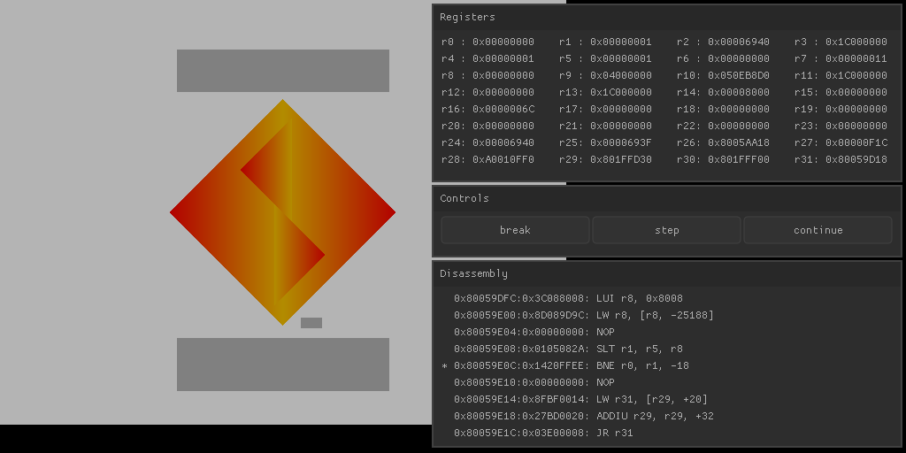

# LPSX

WIP ps1 emulator

## build
currently only tested with msys2
1. build glfw as static library
2. run build.sh
3. put SCPH1001.BIN in bios/

## tasks
- dma rewrite
- stack/memory viewer
- breakpoints
### future goals
- proper build system, probably cmake
- vulkan rendering
- jit recompiler
- hle bios
